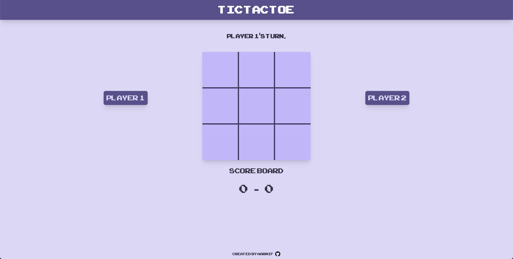

# TIC-TAC-TOE

This is a tic-tac-toe game built with HTML, CSS and JavaScript.
The project is part of the [The Odin Project's](https://www.theodinproject.com/) Full Stack JavaScript Course.

## Features

- Users can play againts each other.
- Users can keep track of the score.
- Users can start a new game.
- Users can choose their own names.

## Live Preview

[TIC-TAC-TOE](https://aarnif.github.io/odin-tic-tac-toe/)

## Technologies

- HTML
- CSS
- JavaScript

## Image


Image of the tic-tac-toe game.

## Instructions

```
HTTPS - git clone https://github.com/aarnif/odin-tic-tac-toe.git

SSH - git clone git@github.com:aarnif/odin-tic-tac-toe.git

cd odin-tic-tac-toe

open index.html with your browser
```
